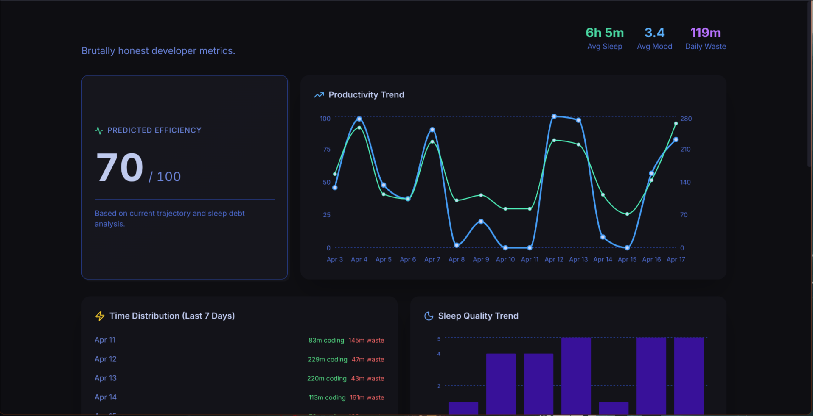
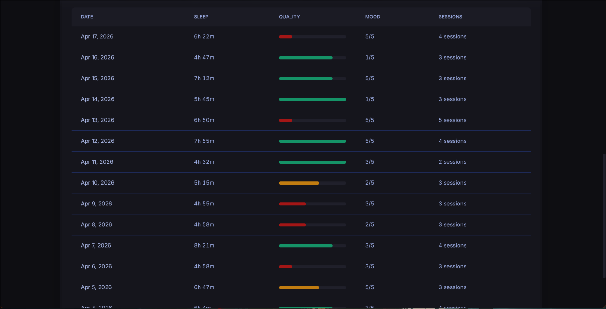

# Personal Analytics

A full-stack web application for tracking and analyzing personal developer metrics, including sleep patterns, mood scores, coding productivity, and activity sessions. The app provides AI-powered insights to help developers optimize their habits and performance.

---

## Features

- **Daily Logging**
  - Record daily metrics:
    - Sleep hours
    - Mood scores (1–5)
    - Total coding minutes
    - Productivity scores

- **Activity Tracking**
  - Log detailed activity sessions with:
    - Categories (Coding, Distraction, Generic)
    - App names
    - Durations

- **AI Insights**
  - Automated analysis providing:
    - Sleep debt warnings
    - Distraction pattern detection
    - Productivity trend insights

- **Data Visualization**
  - Interactive charts showing:
    - Productivity trends
    - Sleep patterns
    - Mood variations

- **SQLite Database**
  - Local storage using SQLAlchemy ORM

---

## Tech Stack

### Backend
- Python 3.x
- FastAPI
- SQLAlchemy
- SQLite
- Pydantic
- Pandas
- Scikit-learn

### Frontend
- React 19
- TypeScript
- Vite
- Tailwind CSS
- Recharts
- Axios
- Lucide React

---

## Installation

### Prerequisites
- Python 3.8+
- Node.js 16+
- npm or yarn

---

## Backend Setup

```bash
cd backend
python -m venv venv
source venv/bin/activate  # Windows: venv\Scripts\activate
pip install -r requirements.txt
```

---

## Frontend Setup

```bash
cd frontend
npm install
```

---

## Usage

### Run Backend

```bash
cd backend
uvicorn main:app --reload
```

API: http://localhost:8000

---

### Run Frontend

```bash
cd frontend
npm run dev
```

App: http://localhost:5173

---

### Seed Sample Data

```bash
cd backend
python seed.py
```

---

## Project Structure

```
Personal_Analytics/
├── backend/
│   ├── analytics.py
│   ├── database.py
│   ├── main.py
│   ├── models.py
│   ├── requirements.txt
│   └── seed.py
└── frontend/
    ├── public/
    ├── src/
    │   ├── components/
    │   │   └── Dashboard.tsx
    │   ├── App.tsx
    │   ├── main.tsx
    │   └── index.css
    ├── package.json
    ├── vite.config.ts
    └── tsconfig.json
```

---

## API Endpoints

### Logs

- `POST /api/logs`
  - Create a new daily log entry

- `GET /api/logs`
  - Retrieve all logs

---

### Insights

- `GET /api/insights`
  - Get AI-generated insights

---

## Screenshots / Demo




---

## Contributing

```bash
git checkout -b feature/amazing-feature
git commit -m "Add some amazing feature"
git push origin feature/amazing-feature
```

Then open a Pull Request.

---

## License

This project is licensed under the MIT License.

Note: Some parts of this project were developed with the assistance of AI tools.
